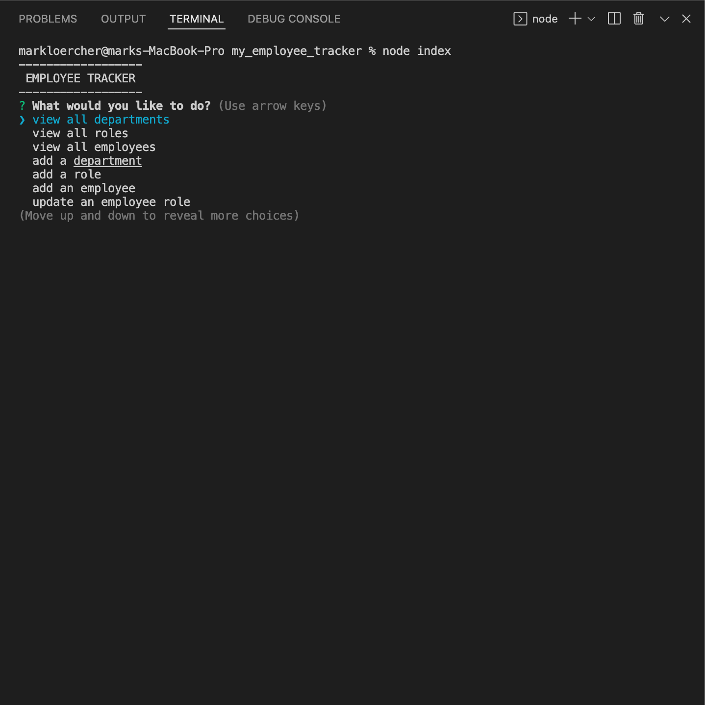
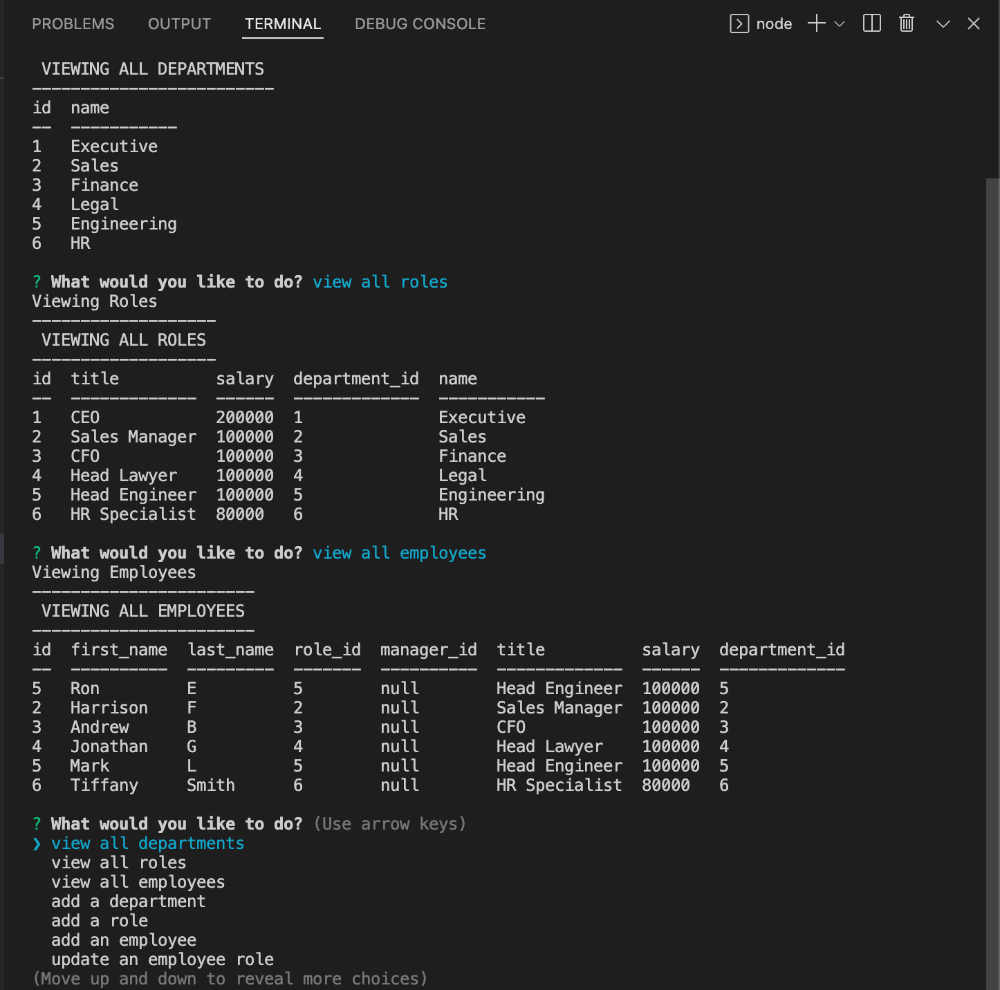

# MY_EMPLOYEE_TRACKER

MY_EMPLOYEE_TRACKER is a CLI program to build, edit and view your company's employees and department structure. Users can add employees, departments and roles as well as edit current ones. 

## User Story

```md
AS A business owner
I WANT to be able to view and manage the departments, roles, and employees in my company
SO THAT I can organize and plan my business
```

## Screen Shots




## Demo
https://share.vidyard.com/watch/yxnVNV7g3ebBUtToB8PhML?
